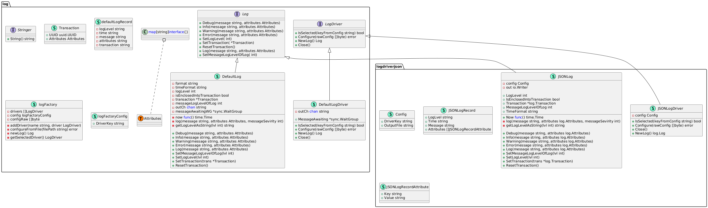

## Solution Overview
The repository contains three go modules. 
* `log`: the log library with interfaces for implementing a loger, an implementation of CLI logger used as default logger, logic for managing logging drivers
* `log-driver-json`: a quick and dirty implementation of a json-file log driver. The sole purpose of that module is to demonstrate the way to add an additonal log driver
* `example-application`: provides an example of usage of the log library and the additional json-file dirver

## Usage
### Running App
`cd example-application`    
`go run .`  
`cat log.json`

### Selecting Logging Driver
The `config.json` file in the `example-application` module can be used to switch between two logging drivers. In order to activate the `cli` driver set the `driver` field value to `cli`. Removing the `driver` field completly out of the config has the same result. To activate the `json-file` driver set the `driver` field value to `json-file`. The log messages are placed to the file specified in the `output` field of the config.

The use cases of the log functionality can be found in the `default_test.go`.

## Class Diagram
The key entities are:
* `log.Log` an interface for a Loger, defines the main functionality related to logging 
* `log.Driver` an interface for a logging driver, defines how a new instance of a logger can be obtain and responsible for enabling a driver to be picked by the `log` package
* `log.logFactory` manages logging drivers, provides that functionality to an application though the wraping functions like `log.NewLog()`
* `log.defaultLog` and `log.defaultLogDriver` an implementation of the `CLI` driver. The library utilizes that driver when no driver has been specified.
* `logdriverjson.JSONLog` and `logdriverjson.JSONLogDriver` a partial implementation of the `json-file` logging driver. The driver lacks most of the log functionality. Its goal is to demonstrate how another logging driver can be implemented and enabled in an application.

## Limitations
Please note that the `json-file` driver is roughly implemented and lacks most of the logging functionality.